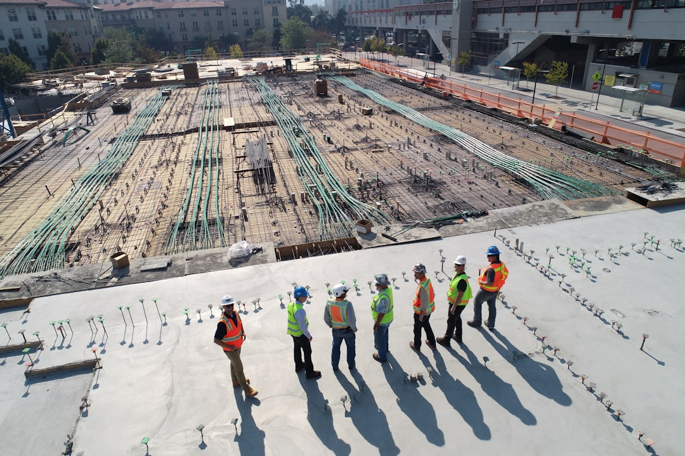

Building Your Vision Today

# Your Trusted Construction Services Expert

Who We Are

## Your Trusted Construction Services Partner

### as2built is a premier provider of construction services, specializing in BIM design and management.

Our services encompass BIM design, construction planning, scheduling, and cost control, ensuring quality and efficiency in every project. What sets as2built apart is our commitment to innovation and client satisfaction. We are proud recipients of multiple industry awards, recognizing our excellence in project execution and customer service.

At as2built, we've delivered remarkable results for our clients through efficient BIM design and construction management. Our focus on meticulous planning, scheduling, and cost control ensures that every project not only meets but exceeds expectations, steering us towards long-term partnerships and successful outcomes.

Our Commitment

### Guiding Principles of Excellence

Our mission at as2built is to transform construction processes through innovative BIM design and unparalleled management practices. We strive to deliver projects that exemplify quality, efficiency, and sustainability, while fostering enduring relationships with our clients and partners.

Core Principles

### Foundation of Our Service

At as2built, we value integrity, collaboration, and innovation. These principles are at the heart of our operations, guiding our decisions, shaping our culture, and ensuring we deliver outstanding results while nurturing a positive environment for our clients and team alike.

Common Inquiries

## Questions About Our Services

What services do you offer?

We specialize in BIM design, construction planning, scheduling, and cost control. Our comprehensive range of services is tailored to ensure that your project runs smoothly and efficiently from conception through completion.

How do you ensure project quality?

Quality is paramount at as2built. We employ rigorous project management techniques, utilize advanced technology, and maintain open communication to ensure every aspect of the construction process meets our high standards and client expectations.

Can you handle large-scale projects?

Absolutely! Our team has vast experience managing projects of various sizes, ensuring that we have the resources and expertise necessary to handle large-scale developments efficiently while maintaining our commitment to quality and precision.

