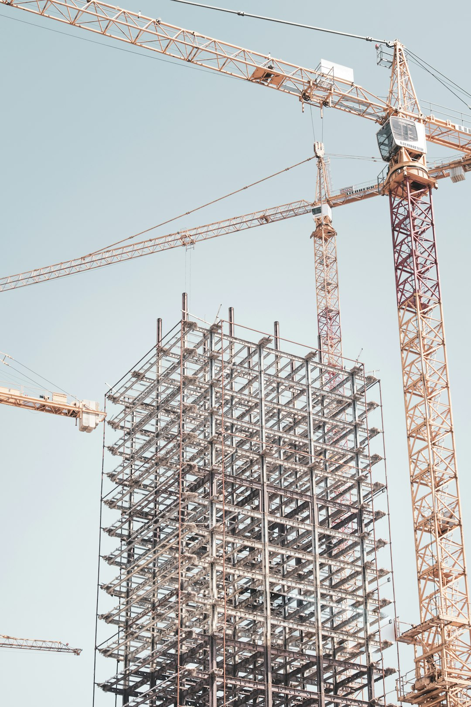
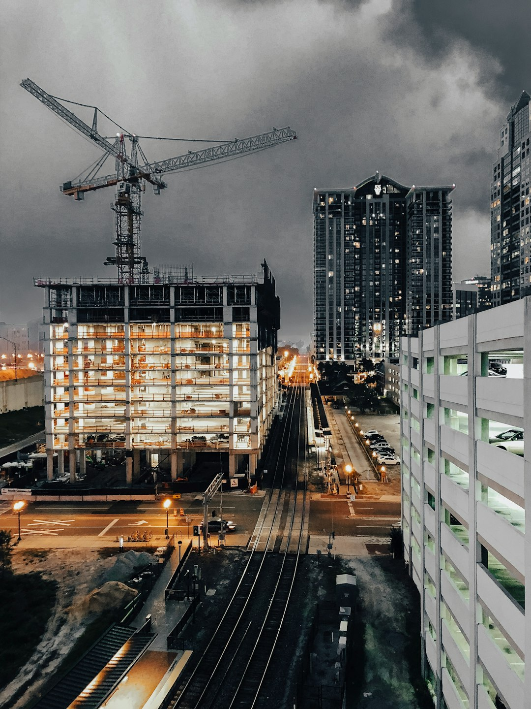

Our Expert Services

# Comprehensive Construction Solutions for You

01.

## BIM Design Services

Our BIM Design Services utilize cutting-edge technology to create detailed 3D models of your project. This collaborative approach ensures all stakeholders have access to up-to-date information, minimizing errors and enhancing communication. By leveraging BIM, we optimize design, streamline workflows, and improve overall project efficiency. Our experienced team works closely with architects and engineers to address every detail, ultimately delivering a reliable and efficient construction plan tailored to your specific needs.

02.

## Construction Planning

Our Construction Planning services encompass comprehensive assessments and strategic planning to guide your project from conception to completion. We analyze timelines, resources, and budgets to create a detailed roadmap that aligns with your goals. Through meticulous planning, we identify potential challenges and implement effective solutions ahead of time. This proactive approach minimizes delays and keeps your project on track, resulting in timely and on-budget outcomes. Trust our expertise to navigate the complexities of construction with efficiency and precision.

03.

## Cost Control Management

Our Cost Control Management service is designed to help you manage and optimize project expenditures. We implement rigorous budgeting processes and continuous monitoring to ensure all costs are tracked and controlled throughout the project lifecycle. Our expert team conducts regular financial assessments to identify areas for improvement and provides actionable insights to maintain budget compliance. By focusing on cost efficiency, we help safeguard your investment and maximize the value of your construction project.

04.

## Scheduling Services

Our Scheduling Services are essential to maintaining an organized and efficient workflow on your construction site. We develop comprehensive schedules that consider all project phases, from initial planning to final delivery. Our team utilizes advanced scheduling tools to track progress and ensure timely completion of tasks. By setting realistic milestones and deadlines, we foster accountability among stakeholders and keep all parties informed. Our proactive approach to scheduling not only mitigates risks but also ensures that your project stays on schedule and meets all client expectations.
